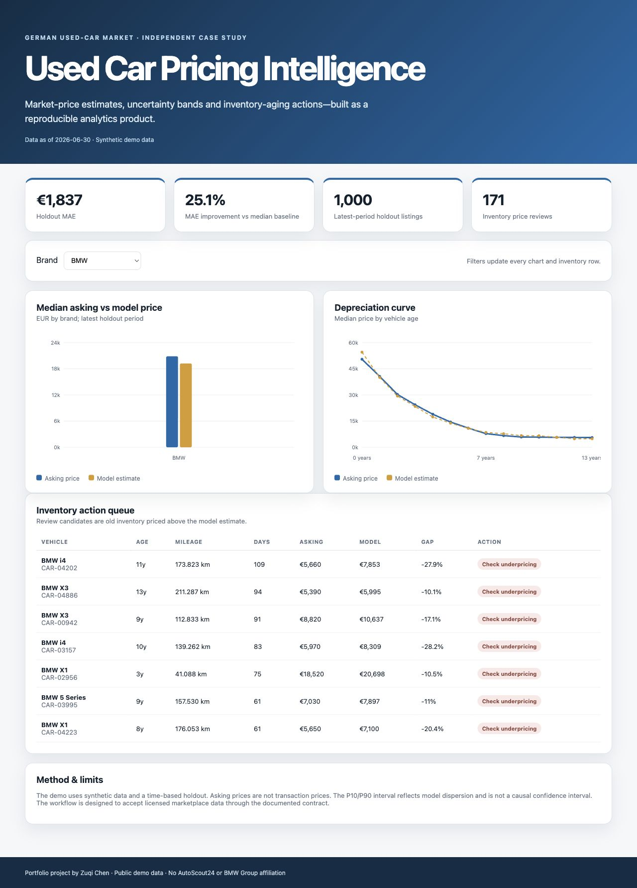

# Used Car Pricing Intelligence

An end-to-end analytics product for a **German used-car marketplace scenario**. It turns listing-level data into a defensible market-price estimate, an uncertainty band, inventory-aging actions, and an executive dashboard.

> Independent portfolio project. AutoScout24 is used only as market context. This repository is not affiliated with, endorsed by, or based on internal data from AutoScout24 or BMW Group.



## Business question

For each vehicle, what is a defensible retail price today, how uncertain is that estimate, and which aging listings require a price action?

## What this project demonstrates

- Reproducible raw → validated → model-ready pipeline
- Time-based model validation rather than a leakage-prone random split
- Baseline comparison, MAE, MAPE and empirical prediction bands
- Data-quality checks for duplicates, nulls, ranges and category drift
- Inventory-aging and price-gap recommendations
- A dependency-free interactive dashboard that opens locally
- Tests and GitHub Actions CI

## Quick start

```bash
python -m venv .venv
source .venv/bin/activate
pip install -r requirements.txt
python src/generate_data.py
python src/pipeline.py
python -m unittest discover -s tests -p "test_*.py"
python -m http.server 8000
```

Open `http://localhost:8000/dashboard/`.

The included generator creates a clearly labelled synthetic German-market dataset so the full repository runs without credentials or marketplace scraping. To use licensed listing data, map it to the contract in [`docs/data-contract.md`](docs/data-contract.md).

## Architecture

```text
synthetic/contracted listings
        │
        ▼
schema + quality validation
        │
        ▼
time-aware feature pipeline
        │
        ├── median-price baseline
        └── regularized log-price model
                   │
                   ▼
      price estimate + P10/P90 band
                   │
                   ▼
 inventory actions + dashboard dataset
```

## Key definitions

- **Price MAE:** mean absolute error on listings from the latest 20% of the observation window.
- **Baseline improvement:** reduction in MAE versus a model-and-age median-price baseline.
- **Price gap:** `(asking price - model estimate) / model estimate`.
- **Action candidate:** listing older than 45 days and priced more than 5% above the model estimate.
- **Prediction band:** model estimate adjusted by empirical P10/P90 training residuals. It is an error band, not a formal causal confidence interval.

## Repository map

```text
data/                    generated sample and model outputs
src/generate_data.py     reproducible synthetic listing generator
src/pipeline.py          validation, training, evaluation and export
dashboard/               interactive portfolio dashboard
tests/                   metric and data-contract tests
docs/                    architecture, data contract and model card
```

## Honest limitations

- The bundled data are synthetic and demonstrate the workflow, not the real German market.
- Marketplace asking prices are not transaction prices.
- Geographic supply, dealer negotiation, option packages and seasonality can introduce omitted-variable bias.
- The recommendation is decision support; it does not autonomously set prices.
